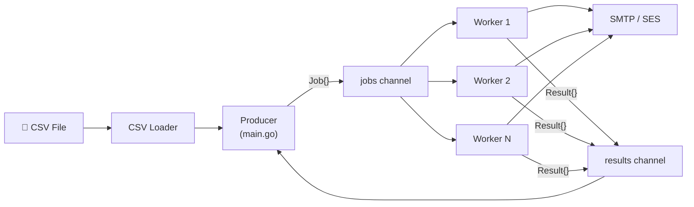

# 📧 Email Dispatcher

A high-throughput, concurrent email campaign delivery system built in Go. Reads recipients from a CSV file, constructs personalized emails, and dispatches them through a pool of concurrent workers via SMTP — with AWS SES integration planned.

---

## Overview

Email Dispatcher solves the problem of **sending personalized bulk emails efficiently and reliably**. Instead of sending emails sequentially (which is slow and fragile), it uses Go's native concurrency primitives — goroutines, channels, and a worker pool — to dispatch emails in parallel with automatic retry on failure.

### Key Features

| Feature | Status |
|---------|--------|
| CSV recipient loading with validation | ✅ Implemented |
| Recipient data model (`Name`, `Email`) | ✅ Implemented |
| SMTP email sending with `PlainAuth` | 🔧 Scaffolded |
| `{{name}}` template substitution | 🔧 Scaffolded |
| Concurrent worker pool (goroutines + channels) | 🔧 Scaffolded |
| Retry with exponential backoff (3 attempts) | 🔧 Scaffolded |
| Send/fail summary reporting | 🔧 Scaffolded |
| AWS SES integration | 📋 Planned |
| Rate limiting | 📋 Planned |
| Graceful shutdown | 📋 Planned |

---

## Architecture Overview



The system follows a **Producer → Channel → Worker Pool → Sender** pipeline:

1. **CSV Loader** parses recipients into typed structs.
2. **Producer** (main goroutine) creates `Job` structs and pushes them onto a buffered channel.
3. **Worker Pool** — N goroutines pull jobs from the channel and send emails concurrently.
4. **Results** flow back through a results channel for summary reporting.

> See [ARCHITECTURE.md](ARCHITECTURE.md) for full details, sequence diagrams, and concurrency design.

---

## Tech Stack

| Component | Technology |
|-----------|------------|
| Language | Go 1.25+ |
| CSV Parsing | `encoding/csv` (stdlib) |
| SMTP | `net/smtp` (stdlib) |
| Concurrency | Goroutines, Channels, `sync.WaitGroup` |
| Configuration | `.env` file via `godotenv` |
| Email Provider | SMTP (current), AWS SES (planned) |

---

## Project Structure

```
email-dispatcher/
├── cmd/
│   └── main.go                  # Entry point — orchestrator / producer
├── data/
│   └── recipients.csv           # Recipient list (email, name)
├── internal/
│   ├── dispatcher/
│   │   └── worker.go            # Worker pool — Job, Result, StartWorker()
│   ├── loader/
│   │   ├── csv.go               # CSV parser — LoadRecipients()
│   │   └── csv_test.go          # Loader unit tests
│   ├── models/
│   │   └── recipients.go        # Recipient struct
│   └── sender/
│       └── smtp.go              # SMTP sender — Send(), EmailConfig
├── .env                         # SMTP/SES credentials (git-ignored)
├── .gitignore
├── go.mod
├── go.sum
├── ARCHITECTURE.md              # System architecture documentation
├── PLANNING.md                  # Phased development plan
├── ROADMAP.md                   # Implementation roadmap
└── README.md                    # This file
```

---

## How the System Works

### 1. Load Recipients
```
recipients.csv → LoadRecipients() → []models.Recipient
```
The CSV loader reads the file, validates the header and each row, and returns a slice of `Recipient` structs.

### 2. Produce Jobs
```
[]Recipient → main.go → Job{Recipient, Subject, Body} → jobs channel
```
The main goroutine creates a `Job` for each recipient and pushes it onto the buffered `jobs` channel.

### 3. Dispatch via Worker Pool
```
jobs channel → Worker goroutines → sender.Send() → SMTP server
```
N worker goroutines pull jobs from the shared channel. Each worker calls `Send()` with up to 3 retry attempts (exponential backoff).

### 4. Collect Results
```
results channel → main.go → "Sent=X Failed=Y"
```
Each worker writes a `Result` to the results channel. After all workers finish, the main goroutine tallies successes and failures.

---

## Setup Instructions

### Prerequisites

- [Go 1.25+](https://go.dev/dl/) installed
- An SMTP server or AWS SES account for sending emails

### Clone

```bash
git clone https://github.com/guptakartike/email-dispatcher.git
cd email-dispatcher
```

### Configure

Create a `.env` file in the project root:

```env
SMTP_HOST=email-smtp.ap-south-1.amazonaws.com
SMTP_PORT=587
SMTP_USER=your_smtp_username
SMTP_PASS=your_smtp_password
SENDER_EMAIL=you@example.com
```

### Install Dependencies

```bash
go mod tidy
```

---

## Environment Variables

| Variable | Required | Description |
|----------|----------|-------------|
| `SMTP_HOST` | Yes | SMTP server hostname |
| `SMTP_PORT` | Yes | SMTP server port (typically `587` for TLS) |
| `SMTP_USER` | Yes | SMTP authentication username |
| `SMTP_PASS` | Yes | SMTP authentication password |
| `SENDER_EMAIL` | Yes | "From" email address |

---

## How to Run

### Run the program

```bash
go run ./cmd
```

**Current output** (Step 1 — CSV loader only):
```
Loaded 1 recipient(s):
  1. kartike <kartikegupta01@gmail.com>
```

### Run tests

```bash
go test ./...
```

### Run tests with race detection

```bash
go test -race ./...
```

### Format code

```bash
gofmt -w .
```

---

## CSV Format

The recipient CSV file must have a header row with `email` and `name` columns:

```csv
email,name
alice@example.com,Alice
bob@example.com,Bob
charlie@example.com,Charlie
```

- **Column 1:** Email address
- **Column 2:** Recipient name (used for `{{name}}` template substitution)
- Rows with fewer than 2 columns will produce an error.

---

## Current Implementation Status

| Component | File | Status |
|-----------|------|--------|
| Recipient model | `internal/models/recipients.go` | ✅ Complete |
| CSV loader | `internal/loader/csv.go` | ✅ Complete |
| Loader tests | `internal/loader/csv_test.go` | ✅ Complete (5 tests) |
| Main (loader test) | `cmd/main.go` | ✅ Complete |
| SMTP sender | `internal/sender/smtp.go` | 🔧 Scaffolded (not wired) |
| Worker pool | `internal/dispatcher/worker.go` | 🔧 Scaffolded (not wired) |
| AWS SES sender | — | 📋 Planned |
| Rate limiting | — | 📋 Planned |

> **Currently active:** Phase 1 (CSV Loading) is complete. The system loads and displays recipients but does not yet send emails.

---

## Roadmap

| Phase | Description | Status |
|-------|-------------|--------|
| 1 | CSV recipient loading | ✅ Complete |
| 2 | Email job model | ⬜ Next |
| 3 | Producer (main.go orchestration) | ⬜ Planned |
| 4 | Channel pipeline | ⬜ Planned |
| 5 | Worker pool | ⬜ Planned |
| 6 | SMTP sender | ⬜ Planned |
| 7 | AWS SES integration | ⬜ Planned |
| 8 | Error handling & retries | ⬜ Planned |
| 9 | Concurrency & rate limiting | ⬜ Planned |
| 10 | Testing | ⬜ Planned |
| 11 | Production improvements | ⬜ Planned |

> See [ROADMAP.md](ROADMAP.md) for detailed breakdowns and [PLANNING.md](PLANNING.md) for implementation specifics.

---

## Future Improvements

- **AWS SES** as a first-class delivery backend with IAM auth
- **Rate limiting** to respect provider quotas (e.g., SES: 14 emails/sec)
- **Graceful shutdown** on `SIGINT`/`SIGTERM`
- **Structured logging** with `log/slog`
- **HTML emails** with MIME multipart support
- **Dry-run mode** for testing without sending
- **Docker** containerization
- **CI/CD** pipeline with GitHub Actions
- **Email validation** and deduplication in the CSV loader
- **Campaign progress bar** with real-time status

---

## License

This project is for educational and personal use.