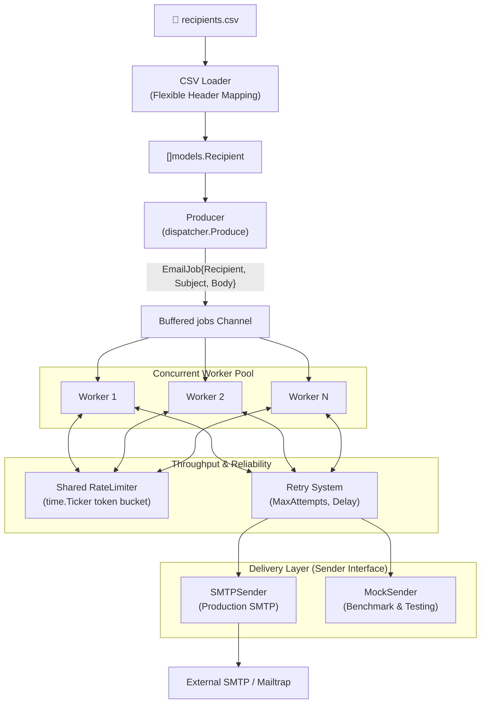

# ⚡ MailPunk

A high-throughput, concurrent email campaign delivery system built in Go. Reads recipients from a CSV file, constructs personalized email jobs, and dispatches them through a configurable worker pool using Go's native concurrency primitives (goroutines, channels, and atomic synchronization) — featuring a shared token-bucket rate limiter, configurable retry system with backoff, swappable sender interface, and an integrated performance benchmark suite.

---

## Overview

Sending bulk email sequentially is slow and vulnerable to rate-limiting and intermittent network failures. **MailPunk** provides a robust **Producer → Channel → Worker Pool → Rate Limiter & Retry → Sender** architecture that delivers emails in parallel while strictly adhering to external SMTP sending quotas.

### Key Features

| Feature | Status | Description |
|---------|--------|-------------|
| **Flexible CSV Recipient Loader** | ✅ Implemented | Automatically maps `email` and `name` columns regardless of header order |
| **Data Models** | ✅ Implemented | `Recipient` and `EmailJob` structures with personalization metadata |
| **Producer & Channel Pipeline** | ✅ Implemented | Non-blocking producer pushing jobs onto a buffered channel |
| **Concurrent Worker Pool** | ✅ Implemented | Configurable number of worker goroutines coordinated via `sync.WaitGroup` |
| **Shared Rate Limiter** | ✅ Implemented | Concurrency-safe token-bucket ticker shared across all workers |
| **Resilient Retry Mechanism** | ✅ Implemented | Independent per-worker retries with configurable delay and max attempts |
| **Swappable Sender Interface** | ✅ Implemented | `Sender` interface decoupling delivery logic from worker dispatching |
| **Production SMTP Sender** | ✅ Implemented | `net/smtp` delivery with RFC 5322 formatting and template substitution |
| **Performance Benchmark Suite** | ✅ Implemented | Standalone benchmark (`cmd/benchmark`) with `MockSender` |
| **AWS SES Backend** | 📋 Planned | Swappable SES backend via AWS SDK v2 |
| **Graceful OS Signal Shutdown** | 📋 Planned | `SIGINT`/`SIGTERM` context cancellation for in-flight jobs |

---

## System Architecture



---

## Tech Stack

| Component | Technology | Description |
|-----------|------------|-------------|
| **Language** | Go 1.25+ | Modern standard Go idioms |
| **CSV Parsing** | `encoding/csv` | Standard library CSV parsing with dynamic column indexing |
| **SMTP Delivery** | `net/smtp` | RFC 5322 plain text formatting with `PlainAuth` |
| **Concurrency** | Goroutines, Channels, `sync.WaitGroup`, `sync/atomic` | Concurrency-safe job distribution and execution telemetry |
| **Rate Limiting** | `time.Ticker` | Token-bucket rate limiter shared across concurrent workers |
| **Configuration** | `github.com/joho/godotenv` | `.env` file loader with environment fallback defaults |

---

## Project Structure

```
email-dispatcher/
├── cmd/
│   ├── main.go                  # CLI entry point — orchestrates pipeline
│   └── benchmark/
│       └── main.go              # Standalone performance benchmark suite
├── data/
│   └── recipients.csv           # Recipient list (auto-maps name, email)
├── docs/
│   ├── ARCHITECTURE.md          # Detailed architecture & concurrency design
│   ├── PLANNING.md              # Phased development history & plan
│   └── ROADMAP.md               # Implementation status & future phases
├── internal/
│   ├── dispatcher/
│   │   ├── producer.go          # Job producer — Produce()
│   │   ├── ratelimiter.go       # Shared token-bucket rate limiter
│   │   └── worker.go            # Worker pool, retry logic & telemetry
│   ├── loader/
│   │   └── csv.go               # CSV loader with flexible header mapping
│   ├── models/
│   │   ├── job.go               # EmailJob struct
│   │   └── recipients.go        # Recipient struct
│   └── sender/
│       ├── mock.go              # MockSender for zero-latency/I/O benchmarks
│       ├── sender.go            # Sender interface & SMTPSender adapter
│       └── smtp.go              # Core SMTP delivery function
├── .env                         # Configuration variables (git-ignored)
├── .gitignore
├── go.mod
├── go.sum
└── README.md
```

---

## Environment Variables

Configure your credentials and pipeline parameters in `.env`:

```env
# SMTP Configuration
SMTP_HOST=sandbox.smtp.mailtrap.io
SMTP_PORT=2525
SMTP_USERNAME=your_username
SMTP_PASSWORD=your_password

# Sender Details
FROM_EMAIL=sender@example.com
FROM_NAME="Campaign Team"

# Retry Policy
MAX_RETRIES=3
RETRY_DELAY_SECONDS=2

# Rate Limiter
EMAILS_PER_SECOND=1
```

| Variable | Required | Default | Description |
|----------|----------|---------|-------------|
| `SMTP_HOST` | Yes | — | SMTP server hostname |
| `SMTP_PORT` | Yes | `2525` | SMTP port (e.g. `2525`, `587`) |
| `SMTP_USERNAME` | Yes | — | SMTP authentication username |
| `SMTP_PASSWORD` | Yes | — | SMTP authentication password |
| `FROM_EMAIL` | Yes | — | Sender email address |
| `FROM_NAME` | No | `""` | Display name of the sender |
| `MAX_RETRIES` | No | `3` | Maximum attempts per email before permanent failure |
| `RETRY_DELAY_SECONDS` | No | `2` | Delay between retry attempts (seconds) |
| `EMAILS_PER_SECOND` | No | `1.0` | Global sending rate limit across all workers |

---

## How to Run

### 1. Run the Campaign Dispatcher

Executes the full production pipeline (CSV load → producer → worker pool → rate limiter → retries → SMTP delivery):

```bash
go run ./cmd
```

**Example output:**
```text
Loaded 6 recipient(s).
Retry config: max 3 attempts, 2s delay.
Rate limit: 1 email(s) per second.
Starting 5 workers...

[Worker 1] Sent to Kartike <guptakartike25.af@gmail.com>
[Worker 2] Sent to Alice <alice@example.com>
[Worker 3] Sent to Bob <bob@example.com>
[Worker 4] Sent to Charlie <charlie@example.com>
[Worker 5] Sent to Diana <diana@example.com>

All jobs processed.
```

### 2. Run the Performance Benchmark Suite

Runs performance benchmarks using an in-memory `MockSender` to measure worker pool throughput without hitting external SMTP provider rate limits:

```bash
go run ./cmd/benchmark
```

**Measured Benchmark Highlights:**
- **Raw In-Memory Throughput:** Up to **13.1 million emails/sec** (1,000 recipients, Rate Limiter bypassed).
- **Concurrent I/O Scaling (2ms simulated latency):**
  - 1 worker: `441 emails/sec`
  - 5 workers: `2,205 emails/sec` (5.0x speedup)
  - 10 workers: `4,407 emails/sec` (10.0x speedup)
  - 20 workers: `8,796 emails/sec` (19.9x speedup)
- **Rate-Limited Constraint:** With `EMAILS_PER_SECOND=100`, throughput across 1, 5, 10, and 20 workers was strictly held to exactly `100 emails/sec` (5.00s for 500 emails).

---

## CSV Recipient Format

The CSV loader supports both `name,email` and `email,name` header layouts:

```csv
name,email
Alice,alice@example.com
Bob,bob@example.com
Charlie,charlie@example.com
```

The loader automatically trims whitespace and maps the columns by header name. If custom headers are used, it falls back to column 0 for email and column 1 for name.

---

## Verification and Formatting

Format all Go files according to standard Go style:

```bash
gofmt -w ./cmd/ ./internal/
```

Verify that all packages compile:

```bash
go build ./...
```