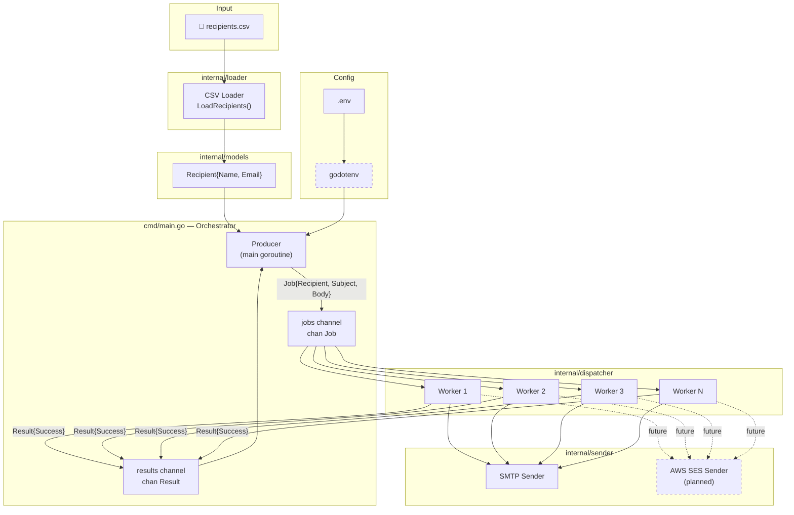
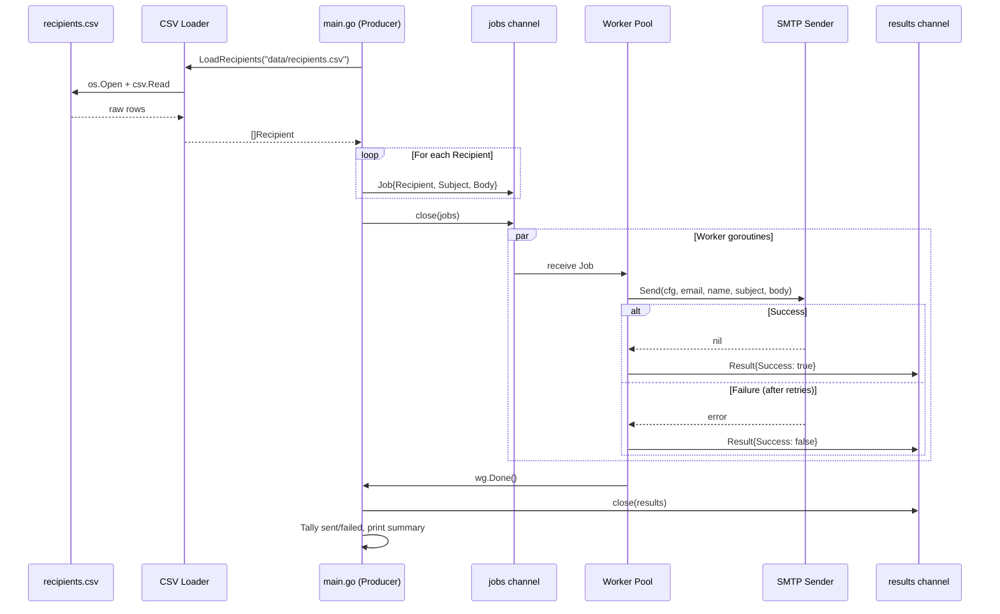
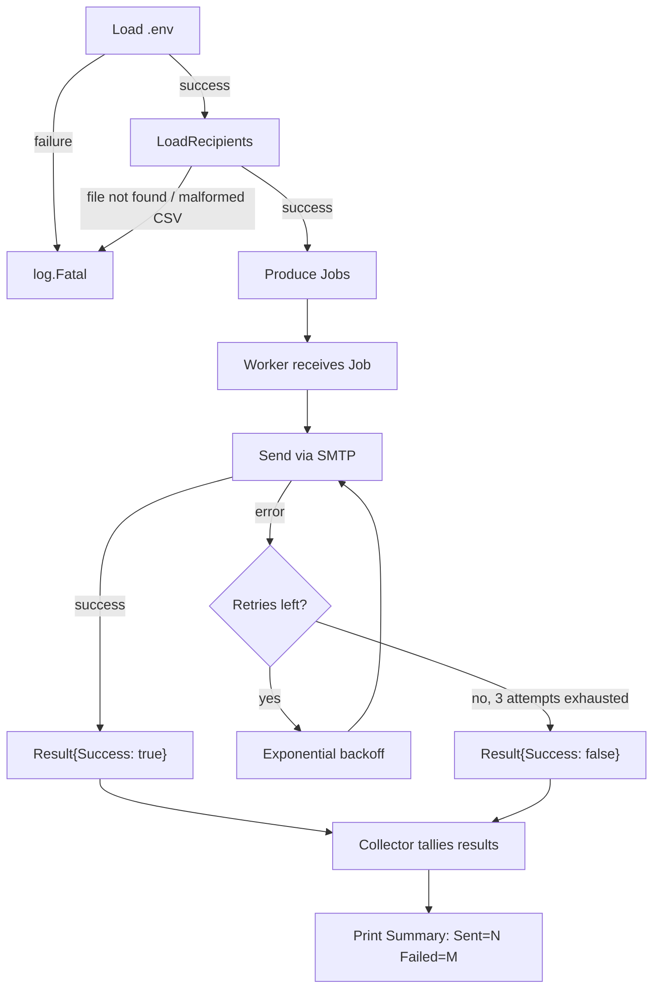
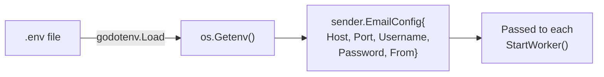

# Architecture

## Overview

Email Dispatcher is a high-throughput, concurrent email campaign delivery system built in Go. It reads recipient data from a CSV file, constructs personalized email jobs, and dispatches them through a pool of concurrent workers using Go's native concurrency primitives (goroutines and channels).

The system follows a **Producer → Channel → Worker Pool → Sender** architecture, enabling efficient parallel delivery with configurable concurrency, retry logic, and support for multiple email backends (SMTP / AWS SES).

---

## System Architecture Diagram



---

## Component Responsibilities

### `cmd/main.go` — Orchestrator

The entry point and **producer**. Responsible for:

- Loading environment configuration (`.env` via `godotenv`).
- Calling the CSV loader to parse recipients.
- Creating buffered `jobs` and `results` channels.
- Spawning the worker pool (goroutines).
- Producing `Job` structs onto the `jobs` channel.
- Collecting `Result` structs from the `results` channel.
- Printing the final send/fail summary.

> **Current state:** Simplified to only test the CSV loader. The full orchestrator logic exists in the codebase but is not wired up yet.

### `internal/models` — Data Models

Defines shared data structures used across packages.

| Struct      | Fields          | Purpose                      |
|-------------|-----------------|------------------------------|
| `Recipient` | `Name`, `Email` | Represents a single recipient parsed from CSV |

### `internal/loader` — CSV Loader

Reads `data/recipients.csv` and returns `[]models.Recipient`.

- Opens and validates the CSV file.
- Reads and validates the header row (requires ≥ 2 columns).
- Parses each data row into a `Recipient` struct.
- Returns descriptive, wrapped errors for file I/O or malformed data.
- Properly closes the file via `defer`.

### `internal/dispatcher` — Worker Pool

Manages concurrent email delivery through a pool of goroutines.

| Type          | Purpose                                                     |
|---------------|-------------------------------------------------------------|
| `Job`         | Bundles a `Recipient` with `Subject` and `Body`             |
| `Result`      | Reports whether a send succeeded or failed                  |
| `StartWorker` | Goroutine that reads from `jobs`, sends via SMTP, writes to `results` |

Each worker:
1. Reads a `Job` from the shared `jobs` channel.
2. Attempts to send the email with up to **3 retries** (exponential backoff: 2s, 4s, 8s).
3. Writes a `Result` to the `results` channel.
4. Signals completion via `sync.WaitGroup`.

### `internal/sender` — Email Sender

Handles the actual email delivery over SMTP.

| Type          | Purpose                                          |
|---------------|--------------------------------------------------|
| `EmailConfig` | SMTP connection parameters (host, port, credentials, from) |
| `Send()`      | Constructs the RFC 5322 message, performs `{{name}}` template substitution, and calls `smtp.SendMail` |

> **Planned:** An AWS SES sender will be added as an alternative backend, implementing the same interface.

---

## Data Flow



---

## Producer-Consumer Architecture

The system uses a classic **fan-out** producer-consumer pattern:

| Role       | Component     | Description                                              |
|------------|---------------|----------------------------------------------------------|
| **Producer** | `main.go`   | Reads all recipients, creates `Job` structs, pushes them onto the buffered `jobs` channel, then closes the channel. |
| **Consumer** | `StartWorker` | N goroutines each pull jobs from the shared channel. Go's channel semantics ensure each job is delivered to exactly one worker. |
| **Collector**| `main.go`   | Reads from the `results` channel after all workers complete to tally success/failure counts. |

### Why Buffered Channels?

Both `jobs` and `results` channels are buffered to `len(recipients)`:
- **`jobs`**: Allows the producer to enqueue all jobs without blocking, then close the channel immediately.
- **`results`**: Allows workers to write results without waiting for the collector.

---

## Worker Pool

```
┌─────────────┐
│  Producer    │
│  (main.go)   │
└──────┬───────┘
       │ jobs channel (buffered)
       ▼
┌──────┴───────┐
│   Fan-Out    │
├──────────────┤
│  Worker 0    │──► SMTP ──► Result
│  Worker 1    │──► SMTP ──► Result
│  Worker 2    │──► SMTP ──► Result
│  Worker 3    │──► SMTP ──► Result
│  Worker 4    │──► SMTP ──► Result
└──────────────┘
       │ results channel (buffered)
       ▼
┌──────────────┐
│  Collector   │
│  (main.go)   │
└──────────────┘
```

- **Worker count**: Currently hardcoded to `5` in `main.go`.
- **Synchronization**: `sync.WaitGroup` ensures all workers finish before results are collected.
- **Graceful shutdown**: Closing the `jobs` channel signals workers to exit their `range` loop.

---

## Goroutines & Channels

| Primitive        | Usage                                                        |
|------------------|--------------------------------------------------------------|
| `go StartWorker(...)` | Spawns each worker as a separate goroutine                |
| `chan Job`        | Buffered channel for distributing work to workers            |
| `chan Result`     | Buffered channel for collecting delivery outcomes            |
| `sync.WaitGroup` | Coordinates shutdown — `wg.Wait()` blocks until all workers call `wg.Done()` |

### Concurrency Safety

- Each worker operates on its own `Job` — no shared mutable state.
- Channel operations are inherently thread-safe.
- The `WaitGroup` ensures deterministic shutdown ordering: workers finish → results channel closed → collector reads.

---

## SMTP / AWS SES Integration

### Current: SMTP (via `net/smtp`)

The existing `sender.Send()` function uses Go's standard library `net/smtp` package with `PlainAuth`. Configuration is loaded from environment variables:

| Variable      | Purpose            |
|---------------|--------------------|
| `SMTP_HOST`   | SMTP server host   |
| `SMTP_PORT`   | SMTP server port   |
| `SMTP_USER`   | SMTP username      |
| `SMTP_PASS`   | SMTP password      |
| `SENDER_EMAIL`| From address       |

### Planned: AWS SES

AWS SES will be integrated as an alternative email backend. The plan:

1. Define a common `EmailSender` interface.
2. Implement `SMTPSender` and `SESSender` behind that interface.
3. Select the backend via configuration (environment variable or flag).
4. SES will use the AWS SDK for Go v2 with IAM credentials.

---

## Error Flow



- **Startup errors** (missing `.env`, unreadable CSV) are fatal — the process exits immediately.
- **Send errors** are retried up to 3 times with exponential backoff (2s, 4s, 8s).
- **After all retries are exhausted**, the failure is recorded as a `Result` — the process continues sending to remaining recipients.

---

## Configuration Flow



All configuration is loaded from environment variables via the `.env` file. The `godotenv` package reads `.env` at startup, making values available through `os.Getenv()`. The resulting `EmailConfig` struct is passed by value to each worker.

> **Note:** The `.env` file is excluded from version control via `.gitignore`.
