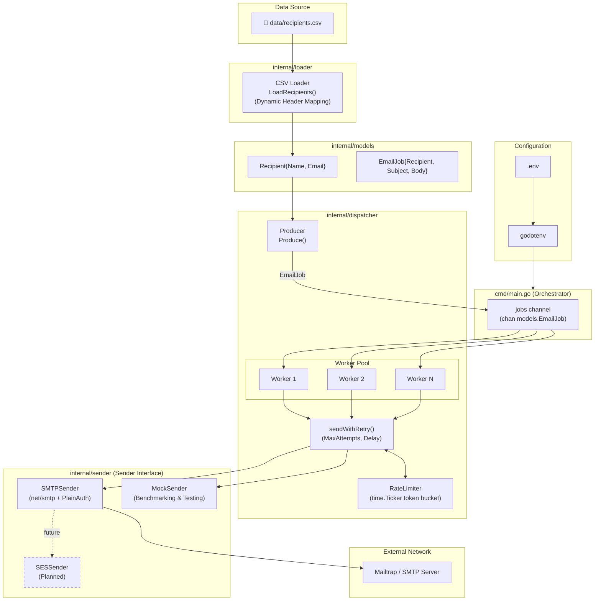
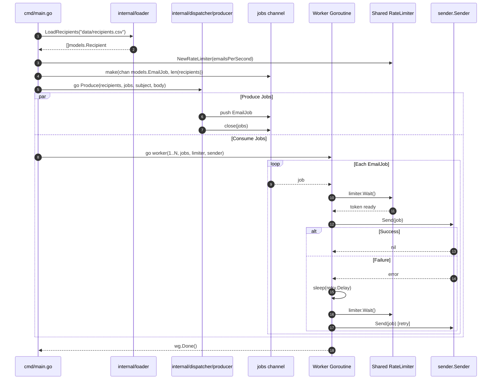

# Architecture

## Overview

Email Dispatcher is a high-throughput, concurrent email campaign delivery system built in Go. It reads recipient data from a CSV file, constructs personalized email jobs, and dispatches them through a pool of concurrent workers using Go's native concurrency primitives (goroutines and channels).

The system follows a **Producer → Channel → Worker Pool → Rate Limiter & Retry → Sender** architecture, enabling efficient parallel delivery with configurable concurrency, a shared token-bucket rate limiter, independent retry backoff on failure, and a swappable delivery interface supporting both production SMTP and high-speed mock benchmarking.

---

## System Architecture Diagram

---

## Component Responsibilities

### 1. `cmd/main.go` — Campaign Pipeline Orchestrator
The CLI entry point responsible for:
- Loading environment configuration (`.env` via `godotenv`).
- Parsing retry parameters (`MAX_RETRIES`, `RETRY_DELAY_SECONDS`) and rate limits (`EMAILS_PER_SECOND`).
- Calling `loader.LoadRecipients()` to parse recipient records.
- Instantiating the shared `dispatcher.RateLimiter`.
- Allocating the buffered `jobs` channel.
- Spawning `dispatcher.Produce` in a background goroutine.
- Initializing `sender.NewSMTPSender(cfg)` and launching the worker pool via `dispatcher.StartWorkers`.

### 2. `cmd/benchmark/main.go` — Performance Benchmark Suite
A standalone runner for measuring dispatcher performance without network interference:
- Benchmarks 500 and 1,000 synthetic recipients across 1, 5, 10, and 20 workers.
- Measures raw in-memory throughput with the rate limiter bypassed.
- Simulates realistic I/O latency (e.g. 2ms per send) to evaluate horizontal scaling.
- Evaluates rate-limiting enforcement (`EMAILS_PER_SECOND=100`).
- Validates the retry mechanism under simulated failure rates.

### 3. `internal/models` — Shared Data Models
- [`Recipient`](file:///Users/kartikegupta/Documents/GitHub/email-dispatcher/internal/models/recipients.go): Encapsulates recipient `Name` and `Email`.
- [`EmailJob`](file:///Users/kartikegupta/Documents/GitHub/email-dispatcher/internal/models/job.go): Encapsulates a `Recipient`, `Subject`, and `Body` template.

### 4. `internal/loader` — Flexible CSV Parser
- Implements `LoadRecipients(filename) ([]models.Recipient, error)`.
- Inspects header columns dynamically to support both `name,email` and `email,name` layouts.
- Trims leading/trailing whitespace on all fields.
- Falls back to default indices (0 for email, 1 for name) if headers are not recognized.

### 5. `internal/dispatcher` — Concurrency & Regulation
- **Producer ([`producer.go`](file:///Users/kartikegupta/Documents/GitHub/email-dispatcher/internal/dispatcher/producer.go))**: Converts recipients into `EmailJob` structs, pushes them to `jobs chan<- models.EmailJob`, and closes the channel when done.
- **Worker Pool ([`worker.go`](file:///Users/kartikegupta/Documents/GitHub/email-dispatcher/internal/dispatcher/worker.go))**: Spawns N worker goroutines reading from the shared channel. Coordinates completion via `sync.WaitGroup` and collects atomic telemetry (`WorkerStats`).
- **Retry System ([`worker.go`](file:///Users/kartikegupta/Documents/GitHub/email-dispatcher/internal/dispatcher/worker.go))**: `sendWithRetry()` attempts delivery up to `MaxAttempts` with `Delay` between attempts. Each worker retries independently without blocking the pool.
- **Shared Rate Limiter ([`ratelimiter.go`](file:///Users/kartikegupta/Documents/GitHub/email-dispatcher/internal/dispatcher/ratelimiter.go))**: A thread-safe token-bucket built with `time.Ticker`. All workers call `limiter.Wait()` before every delivery attempt. Supports transparent bypass when `limiter` is `nil`.

### 6. `internal/sender` — Delivery Abstraction
- **`Sender` Interface ([`sender.go`](file:///Users/kartikegupta/Documents/GitHub/email-dispatcher/internal/sender/sender.go))**: Defines `Send(job models.EmailJob) error`, decoupling the delivery mechanism from the worker pool.
- **`SMTPSender` ([`sender.go`](file:///Users/kartikegupta/Documents/GitHub/email-dispatcher/internal/sender/sender.go))**: Wraps standard library `net/smtp` and `PlainAuth`. Substitutes `{{name}}` in the body and constructs RFC 5322 messages.
- **`MockSender` ([`mock.go`](file:///Users/kartikegupta/Documents/GitHub/email-dispatcher/internal/sender/mock.go))**: In-memory delivery simulator for benchmarks with configurable per-send latency and simulated failure rates.

---

## Data Flow & Lifecycle

---

## Concurrency & Synchronization Model

1. **Producer-Consumer via Go Channels**:
   - The channel buffer matches the total recipient count (`len(recipients)`), ensuring that the producer never blocks while feeding jobs.
   - When the producer finishes, it calls `close(jobs)`. In Go, reading from a closed channel yields remaining buffered items, then returns `false` on the ok-check (`for job := range jobs`), causing workers to terminate cleanly.

2. **Shutdown Coordination via `sync.WaitGroup`**:
   - `StartWorkers` initializes `sync.WaitGroup`, calls `wg.Add(1)` per worker, and defers `wg.Done()` inside each worker.
   - `wg.Wait()` guarantees all in-flight emails, retries, and cleanups finish before `main()` exits.

3. **Telemetry via `sync/atomic`**:
   - Success, failure, and retry counts in `WorkerStats` are incremented using lockless atomic primitives (`atomic.AddInt64`), eliminating mutex lock contention during high-speed benchmarks.
