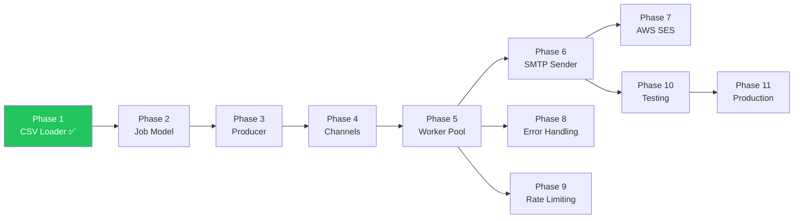

# Development Plan

A phased development plan for the Email Dispatcher — from CSV loading to production-ready campaign delivery.

---

## Phase 1: CSV Recipient Loader ✅

**Goal:** Parse a CSV file into typed Go structs.

**What will be built:**
- `Recipient` model in `internal/models/recipients.go`.
- `LoadRecipients()` function in `internal/loader/csv.go` using `encoding/csv`.
- Header validation and malformed-row error handling.
- Unit tests for the loader.
- Simplified `cmd/main.go` that loads and prints recipients.

**Files/components involved:**

| File | Action |
|------|--------|
| `internal/models/recipients.go` | Created — `Recipient{Name, Email}` |
| `internal/loader/csv.go` | Implemented — `LoadRecipients()` |
| `internal/loader/csv_test.go` | Created — 5 test cases |
| `cmd/main.go` | Modified — calls loader, prints results |

**Expected outcome:**
```
$ go run ./cmd
Loaded 1 recipient(s):
  1. kartike <kartikegupta01@gmail.com>
```

**Status:** ✅ Complete

---

## Phase 2: Email Job Model

**Goal:** Define the data structures that flow through the system's channels.

**What will be built:**
- `Job` struct — bundles a recipient with email subject and body.
- `Result` struct — reports delivery success/failure with metadata.
- Move these types to a shared location or keep in `internal/dispatcher`.

**Files/components involved:**

| File | Action |
|------|--------|
| `internal/dispatcher/worker.go` | Refine `Job` and `Result` types |

**Expected outcome:**
- Clean, well-documented types that represent the unit of work flowing through the pipeline.
- Types are importable by both the producer (`main.go`) and consumers (workers).

---

## Phase 3: Producer

**Goal:** Wire up `main.go` to create jobs from loaded recipients and push them onto a channel.

**What will be built:**
- Load `.env` configuration via `godotenv`.
- Build `EmailConfig` from environment variables.
- Define email subject and body templates.
- Create `Job` structs for each recipient.
- Push jobs onto the `jobs` channel.

**Files/components involved:**

| File | Action |
|------|--------|
| `cmd/main.go` | Restore producer logic — `.env` loading, job creation |
| `.env` | SMTP/SES credentials and configuration |

**Expected outcome:**
- `main.go` loads config, parses recipients, and enqueues `Job` structs.
- The producer can be tested independently by logging jobs instead of sending them.

---

## Phase 4: Channels

**Goal:** Set up the buffered channel pipeline that connects the producer to the worker pool.

**What will be built:**
- Buffered `jobs` channel (`chan dispatcher.Job`).
- Buffered `results` channel (`chan dispatcher.Result`).
- Channel lifecycle management: creation → population → close → drain.

**Files/components involved:**

| File | Action |
|------|--------|
| `cmd/main.go` | Create and manage channels |
| `internal/dispatcher/worker.go` | Workers read from `jobs`, write to `results` |

**Expected outcome:**
- Jobs flow from producer → channel → workers → results channel → collector.
- Channel buffer sizes are correctly set to `len(recipients)`.
- `close(jobs)` signals workers to exit.

---

## Phase 5: Worker Pool

**Goal:** Launch concurrent worker goroutines that consume jobs and send emails.

**What will be built:**
- `StartWorker()` function that runs as a goroutine.
- `sync.WaitGroup` for coordinated shutdown.
- Configurable worker count.
- Fan-out pattern: N workers share a single `jobs` channel.

**Files/components involved:**

| File | Action |
|------|--------|
| `internal/dispatcher/worker.go` | Implement `StartWorker()` |
| `cmd/main.go` | Spawn workers, manage WaitGroup |

**Expected outcome:**
- N goroutines run concurrently, each processing jobs independently.
- All workers finish before results are collected.
- No race conditions (verified with `go test -race`).

---

## Phase 6: SMTP Sender

**Goal:** Send real emails over SMTP using Go's standard library.

**What will be built:**
- `Send()` function using `net/smtp`.
- `EmailConfig` struct for SMTP parameters.
- `PlainAuth` authentication.
- `{{name}}` template substitution in the email body.
- RFC 5322–compliant message formatting.

**Files/components involved:**

| File | Action |
|------|--------|
| `internal/sender/smtp.go` | Implement `Send()` and `EmailConfig` |

**Expected outcome:**
- Emails are delivered to real SMTP servers (e.g., AWS SES SMTP endpoint).
- Personalized body with recipient name substitution.
- Errors are returned to the caller for retry handling.

---

## Phase 7: AWS SES Integration

**Goal:** Add AWS SES as a first-class email delivery backend alongside SMTP.

**What will be built:**
- `EmailSender` interface abstracting the send operation.
- `SMTPSender` — wraps the existing `Send()` function.
- `SESSender` — uses AWS SDK for Go v2 (`ses.SendEmail`).
- Backend selection via environment variable (`EMAIL_BACKEND=smtp|ses`).
- IAM-based authentication for SES.

**Files/components involved:**

| File | Action |
|------|--------|
| `internal/sender/sender.go` | New — `EmailSender` interface |
| `internal/sender/smtp.go` | Refactor to implement `EmailSender` |
| `internal/sender/ses.go` | New — SES implementation |
| `cmd/main.go` | Backend selection logic |
| `go.mod` | Add `aws-sdk-go-v2` dependencies |

**Expected outcome:**
- Swappable email backends with zero changes to the dispatcher.
- SES sender handles AWS-specific auth and API calls.
- SMTP remains the default for local development.

---

## Phase 8: Error Handling & Retry Logic

**Goal:** Make the system resilient to transient failures.

**What will be built:**
- Configurable retry count (currently hardcoded to 3).
- Exponential backoff with jitter.
- Detailed error logging per recipient.
- Enhanced `Result` struct with error messages and attempt count.
- Dead-letter logging for permanently failed recipients.

**Files/components involved:**

| File | Action |
|------|--------|
| `internal/dispatcher/worker.go` | Enhanced retry logic |
| `internal/dispatcher/result.go` | New — enriched `Result` type |
| `cmd/main.go` | Better error reporting in summary |

**Expected outcome:**
- Transient failures (network timeouts, rate limits) are retried automatically.
- Permanent failures are logged with full context.
- Summary includes detailed failure reasons.

---

## Phase 9: Concurrency & Rate Limiting

**Goal:** Control throughput to respect email provider rate limits.

**What will be built:**
- Configurable worker pool size via environment variable.
- Rate limiter (e.g., `golang.org/x/time/rate`) to cap sends per second.
- Graceful shutdown on OS signals (`SIGINT`, `SIGTERM`).
- Context-based cancellation propagation.

**Files/components involved:**

| File | Action |
|------|--------|
| `internal/dispatcher/worker.go` | Add rate limiter, context support |
| `cmd/main.go` | Signal handling, graceful shutdown |

**Expected outcome:**
- Send rate stays within provider limits (e.g., AWS SES: 14 emails/sec).
- `Ctrl+C` triggers a clean shutdown — in-flight emails complete, no orphaned goroutines.

---

## Phase 10: Testing

**Goal:** Comprehensive test coverage across all components.

**What will be built:**
- Unit tests for loader, sender, dispatcher, and models.
- Integration tests with a mock SMTP server.
- Race condition detection (`-race` flag).
- Test helpers and fixtures.

**Files/components involved:**

| File | Action |
|------|--------|
| `internal/loader/csv_test.go` | Exists — expand edge cases |
| `internal/sender/smtp_test.go` | New — mock SMTP tests |
| `internal/dispatcher/worker_test.go` | New — worker pool tests |
| `testdata/` | New — test fixtures directory |

**Expected outcome:**
- `go test ./...` passes with ≥ 80% coverage.
- `go test -race ./...` passes cleanly.
- CI pipeline can run tests without external dependencies.

---

## Phase 11: Production Improvements

**Goal:** Harden the system for production use.

**What will be built:**
- Structured logging (e.g., `log/slog`).
- CLI flags for configuration override (`flag` package).
- Campaign progress bar / real-time status output.
- CSV validation (email format, duplicate detection).
- HTML email support with MIME multipart.
- Dry-run mode for testing without sending.
- Metrics export (total sent, failed, duration).
- Docker containerization.
- CI/CD pipeline configuration.

**Files/components involved:**

| File | Action |
|------|--------|
| Various | Incremental improvements across all packages |
| `Dockerfile` | New — container build |
| `.github/workflows/` | New — CI pipeline |

**Expected outcome:**
- Production-grade reliability, observability, and deployment.
- Easy to run locally or deploy as a container.

---

## Phase Dependencies


