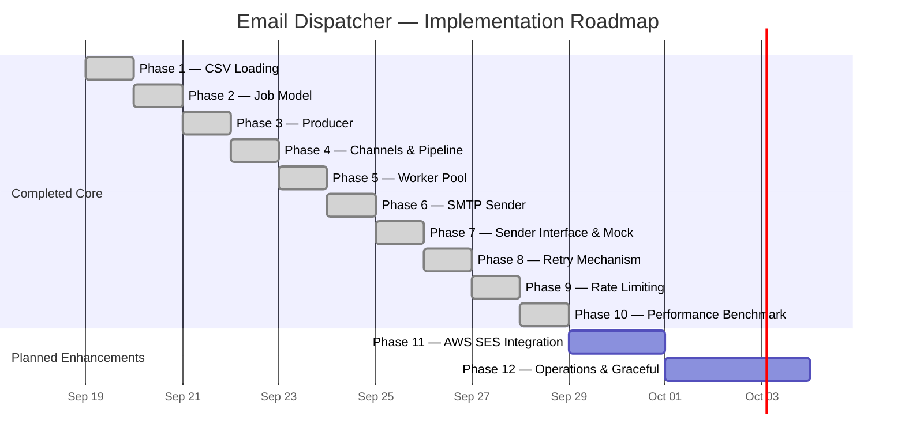

# Roadmap

Implementation roadmap for the Email Dispatcher, ordered by dependency and priority.

---

## 🟢 Core Pipeline & Reliability (Completed)

The core pipeline: load recipients, dispatch emails concurrently, regulate throughput, retry on failure, and measure performance.

---

### Phase 1: CSV Loading ✅

> Parse recipients from a CSV file into typed Go structs.

- [x] Define `Recipient` model (`internal/models/recipients.go`)
- [x] Implement `LoadRecipients()` in `internal/loader/csv.go`
- [x] Header and row validation with descriptive errors
- [x] Automatic column position mapping (`name,email` vs `email,name`)
- [x] Verify with `go run ./cmd`

---

### Phase 2: Email Job Model ✅

> Define the data structures that flow through the dispatch pipeline.

- [x] Define `EmailJob` struct — recipient + subject + body (`internal/models/job.go`)
- [x] Define `Recipient` struct — name + email (`internal/models/recipients.go`)
- [x] GoDoc documentation on all exported model types
- [x] Shared package accessible to loader, dispatcher, and sender

---

### Phase 3: Producer ✅

> Feed the pipeline with jobs constructed from loaded recipients.

- [x] Decouple producer logic into `internal/dispatcher/producer.go`
- [x] `Produce(recipients, jobsChan, subject, body)` function
- [x] Push `EmailJob` structs to the channel
- [x] Close the channel when all jobs are produced to signal workers

---

### Phase 4: Channels & Orchestration ✅

> Connect the producer to the worker pool via buffered Go channels.

- [x] Create buffered `jobs` channel sized to recipient count (`chan models.EmailJob`)
- [x] Manage channel lifecycle: allocate → produce asynchronously → close → drain
- [x] Prevent deadlocks through properly coordinated channel closing
- [x] Pipeline orchestration wired in `cmd/main.go`

---

### Phase 5: Concurrent Worker Pool ✅

> Launch concurrent goroutines that consume jobs from the channel.

- [x] Implement `StartWorkers()` in `internal/dispatcher/worker.go`
- [x] Launch configurable worker goroutines (`workerCount`)
- [x] Coordinated lifecycle and termination via `sync.WaitGroup`
- [x] Collect execution telemetry (`WorkerStats` via `sync/atomic`)

---

### Phase 6: SMTP Sender ✅

> Deliver emails over SMTP using Go's standard library.

- [x] Implement `Send()` with `net/smtp` in `internal/sender/smtp.go`
- [x] Authenticate using `smtp.PlainAuth`
- [x] Dynamic `{{name}}` template replacement
- [x] RFC 5322 MIME message formatting
- [x] End-to-end delivery verified with Mailtrap SMTP

---

### Phase 7: Sender Abstraction & Mocking ✅

> Decouple delivery from worker execution for clean testing and swappable backends.

- [x] Define `Sender` interface in `internal/sender/sender.go`
- [x] Implement `SMTPSender` adapter wrapping `net/smtp`
- [x] Implement `MockSender` in `internal/sender/mock.go` with configurable latency and error injection
- [x] Pass `Sender` into `StartWorkers()`

---

### Phase 8: Retry System ✅

> Make the dispatch pipeline resilient to transient network or provider errors.

- [x] Define `RetryConfig` with `MaxAttempts` and `Delay`
- [x] Configure via `MAX_RETRIES` and `RETRY_DELAY_SECONDS` environment variables
- [x] Independent per-worker backoff so one worker's retry does not block others
- [x] Track retry counts and log permanently failed emails after exhausting attempts

---

### Phase 9: Rate Limiting & Throughput Regulation ✅

> Prevent workers from exceeding external SMTP sending quotas.

- [x] Implement `RateLimiter` in `internal/dispatcher/ratelimiter.go` using `time.Ticker`
- [x] Configure via `EMAILS_PER_SECOND` environment variable
- [x] Concurrency-safe token-bucket shared across all workers
- [x] Safe bypass when rate limiting is disabled (`nil` limiter support)

---

### Phase 10: Performance Benchmarking ✅

> Dedicated benchmark suite to measure raw throughput, scaling, and constraints.

- [x] Implement benchmark CLI runner in `cmd/benchmark/main.go`
- [x] Benchmark 500 and 1,000 recipients across 1, 5, 10, and 20 workers
- [x] Measure raw in-memory throughput (reached 13.1M emails/sec)
- [x] Measure concurrent I/O scaling under simulated latency (near-linear 19.9x speedup with 20 workers)
- [x] Verify strict rate-limiting enforcement (`EMAILS_PER_SECOND=100`)
- [x] Verify retry recovery under simulated failure rates

---

## 🔵 Enhanced — Production Backends & Polish (Planned)

Features that extend the system into enterprise production deployments.

---

### Phase 11: AWS SES Integration

> Add AWS Simple Email Service (SES) as an alternative delivery backend.

- [ ] Implement `SESSender` implementing `sender.Sender` interface
- [ ] Integrate AWS SDK for Go v2 (`aws-sdk-go-v2/service/sesv2`)
- [ ] Backend selection via `EMAIL_BACKEND` env var (`smtp` vs `ses`)
- [ ] AWS IAM role and credentials support
- [ ] SES rate quota alignment

---

### Phase 12: Production Readiness & Operations

> Operational excellence, graceful termination, and advanced content formats.

- [ ] OS signal interception (`SIGINT`, `SIGTERM`) for graceful in-flight job draining
- [ ] Context cancellation propagation (`context.Context`)
- [ ] HTML email support with multipart MIME encoding
- [ ] Structured logging using `log/slog`
- [ ] Progress bar / real-time terminal campaign metrics
- [ ] Docker containerization (`Dockerfile`)
- [ ] GitHub Actions CI pipeline

---

## Roadmap Overview

---

## Legend

| Icon | Meaning |
|------|---------|
| 🟢 | Core Pipeline (Completed) |
| 🔵 | Enhanced & Production (Planned) |
| ✅ | Complete & Verified |
| 📋 | Planned for future phase |
