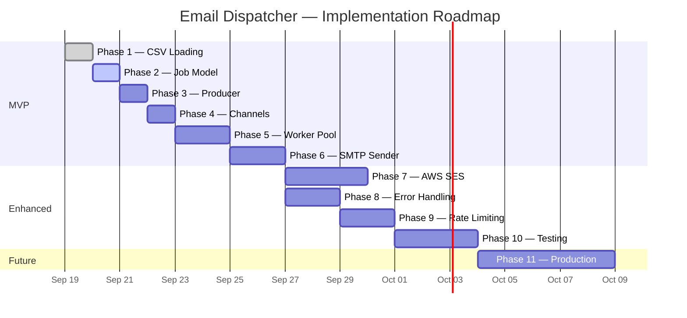

# Roadmap

Implementation roadmap for the Email Dispatcher, ordered by dependency and priority.

---

## 🟢 MVP — Core Pipeline

The minimum viable product: load recipients, dispatch emails concurrently, report results.

---

### Phase 1: CSV Loading ✅

> Parse recipients from a CSV file into typed Go structs.

- [x] Define `Recipient` model (`internal/models/recipients.go`)
- [x] Implement `LoadRecipients()` in `internal/loader/csv.go`
- [x] Header and row validation with descriptive errors
- [x] Unit tests (5 test cases)
- [x] Verify with `go run ./cmd`

---

### Phase 2: Email Job Model

> Define the data structures that flow through the dispatch pipeline.

- [ ] Refine `Job` struct — recipient + subject + body
- [ ] Refine `Result` struct — success flag + error context
- [ ] Document types with GoDoc comments
- [ ] Ensure types are importable across packages

---

### Phase 3: Producer

> Wire up `main.go` to load config, build jobs, and feed the pipeline.

- [ ] Load `.env` via `godotenv`
- [ ] Build `EmailConfig` from environment variables
- [ ] Define email subject and body templates
- [ ] Create `Job` for each loaded recipient
- [ ] Push jobs onto the `jobs` channel

---

### Phase 4: Channels

> Set up buffered channels connecting the producer to the worker pool.

- [ ] Create buffered `jobs` channel (`chan Job`)
- [ ] Create buffered `results` channel (`chan Result`)
- [ ] Manage channel lifecycle (create → populate → close → drain)
- [ ] Verify no deadlocks with small and large recipient lists

---

### Phase 5: Worker Pool

> Launch concurrent goroutines that consume jobs from the channel.

- [ ] Implement `StartWorker()` goroutine
- [ ] Use `sync.WaitGroup` for coordinated shutdown
- [ ] Configure worker count (start with 5)
- [ ] Verify with `go test -race`

---

### Phase 6: SMTP Sender

> Send real emails over SMTP using Go's standard library.

- [ ] Implement `Send()` with `net/smtp`
- [ ] `PlainAuth` authentication
- [ ] `{{name}}` template substitution
- [ ] RFC 5322 message formatting
- [ ] End-to-end test with a real SMTP server

---

### 🎯 MVP Complete

At this point the system can:
1. Load recipients from CSV
2. Build personalized email jobs
3. Dispatch them concurrently through a worker pool
4. Send via SMTP
5. Retry on failure (3 attempts, exponential backoff)
6. Report a sent/failed summary

---

## 🔵 Enhanced — Production Features

Features that take the MVP to a production-ready system.

---

### Phase 7: AWS SES Integration

> Add AWS SES as a swappable email delivery backend.

- [ ] Define `EmailSender` interface
- [ ] Implement `SMTPSender` (wrap existing code)
- [ ] Implement `SESSender` (AWS SDK for Go v2)
- [ ] Backend selection via `EMAIL_BACKEND` env var
- [ ] IAM credential support

---

### Phase 8: Error Handling

> Make the system resilient and observable under failure.

- [ ] Configurable retry count (env var)
- [ ] Exponential backoff with jitter
- [ ] Enriched `Result` with error message and attempt count
- [ ] Dead-letter log for permanently failed recipients
- [ ] Per-recipient error logging

---

### Phase 9: Concurrency & Rate Limiting

> Control throughput and enable graceful shutdown.

- [ ] Configurable worker pool size (env var)
- [ ] Rate limiter (`golang.org/x/time/rate`)
- [ ] OS signal handling (`SIGINT` / `SIGTERM`)
- [ ] Context-based cancellation
- [ ] Graceful in-flight job completion on shutdown

---

### Phase 10: Testing

> Comprehensive test coverage across all packages.

- [ ] Unit tests for all packages
- [ ] Integration tests with mock SMTP server
- [ ] Race condition detection (`-race`)
- [ ] Test coverage ≥ 80%
- [ ] Test fixtures in `testdata/`

---

## 🟣 Future — Nice to Have

Improvements for long-term maintainability and usability.

---

### Phase 11: Production Improvements

> Polish, packaging, and operational excellence.

- [ ] Structured logging (`log/slog`)
- [ ] CLI flags for config override
- [ ] Campaign progress bar / live status
- [ ] CSV validation (email format, deduplication)
- [ ] HTML email support (MIME multipart)
- [ ] Dry-run mode
- [ ] Metrics export (total, duration, throughput)
- [ ] `Dockerfile`
- [ ] CI/CD pipeline (GitHub Actions)

---

## Roadmap Overview

---

## Legend

| Icon | Meaning |
|------|---------|
| 🟢 | MVP — must have for a working system |
| 🔵 | Enhanced — production readiness |
| 🟣 | Future — nice-to-have improvements |
| ✅ | Complete |
| 🎯 | Milestone |
